# Fantasy Football Data Analytics

The following presentation slides outline our methods, findings and the CLI.   
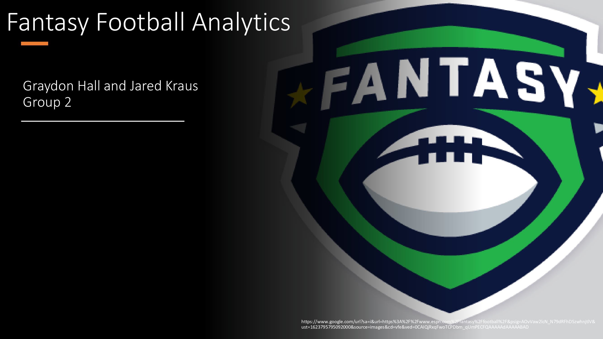 
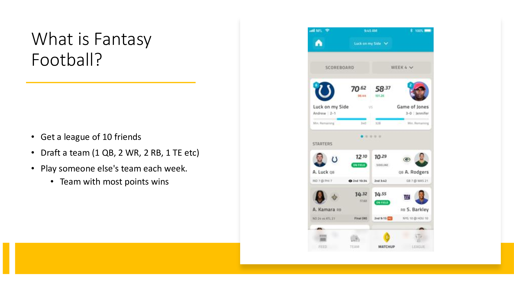 
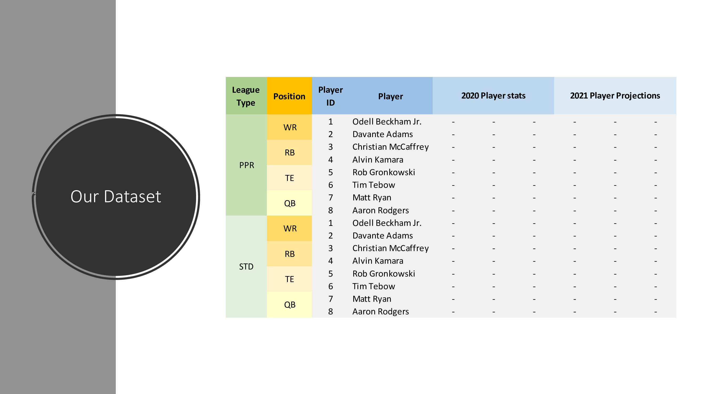 
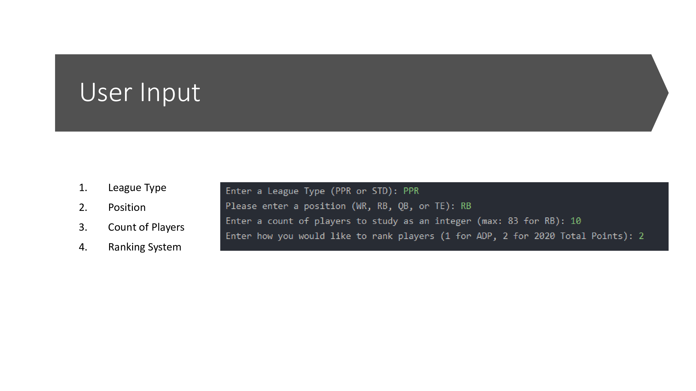 
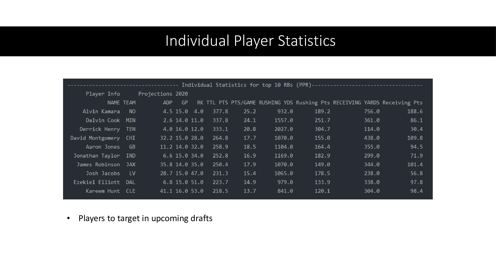 
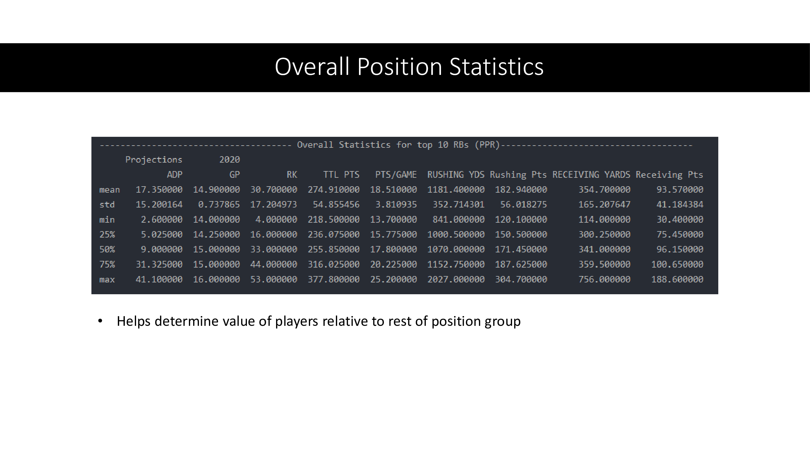 
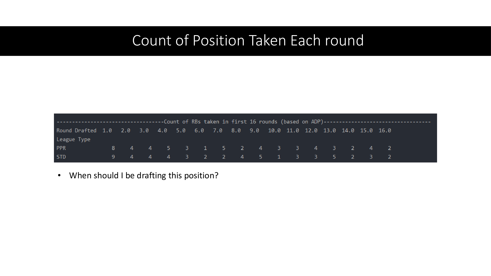 
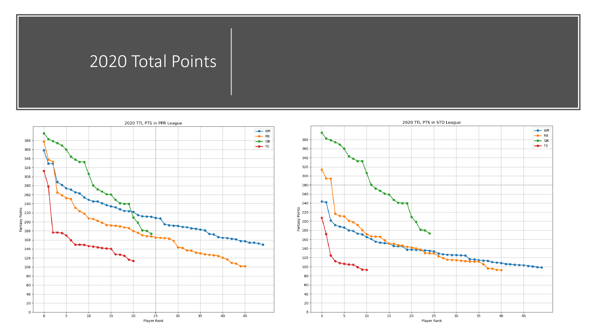 
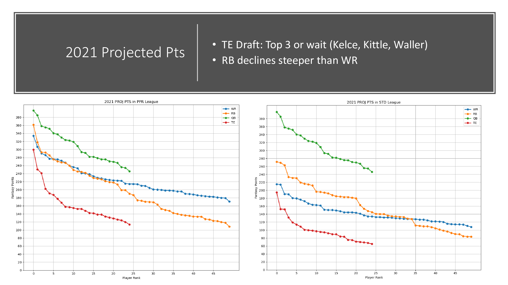 
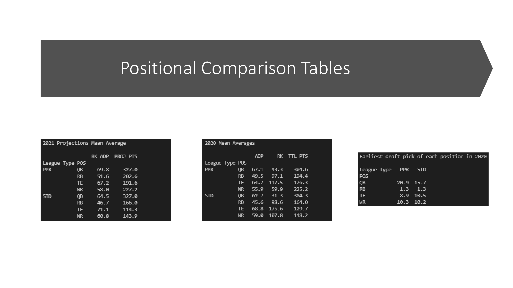 
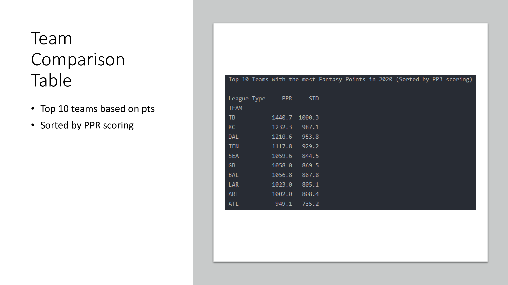 
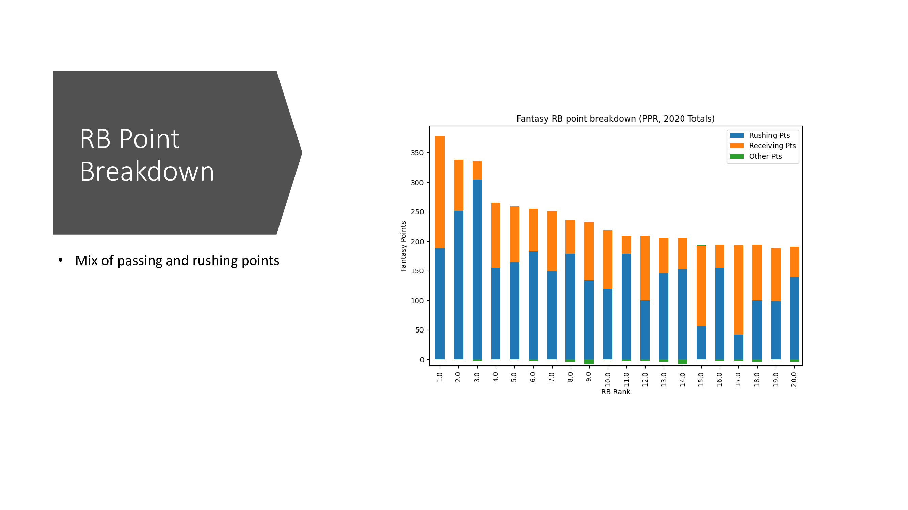 
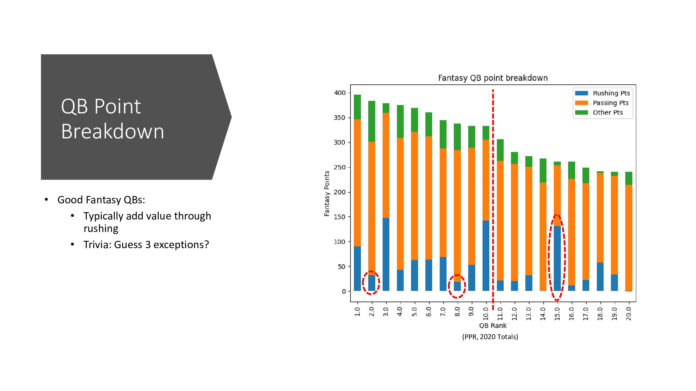 

Contributors: 
* [Graydon Hall](https://github.com/GraydonHall42)
* [Jared Kraus](https://github.com/JaredKraus)
